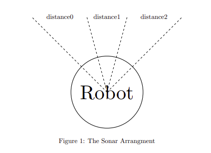
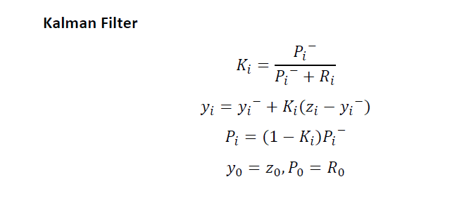
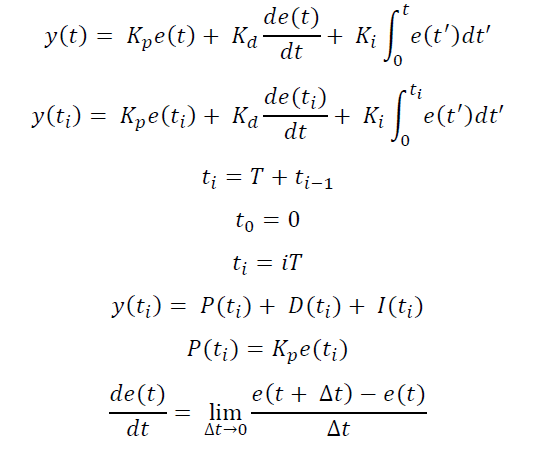

**Task**
Using ROS to drive a robot to a desired target using PID algorithmn and Kalman Filter.
Linux Distro: https://www.ros.org/

**Structure**
Using a feedback loop there are 5 main ROS Nodes
*Controller -> Identifies direction heading and timing for accerelation. Node that send movement instruction to robot.
*Kalman Filter -> Filter that takes in the noisy sonar values and reduces the noise emitted from them
*PID algorithmn -> Algorithmn responsible for calculation movement and adjusting velocity 
*Sonar Wrapper -> Grabs the sonar values

**Input**

**Structure**

**Implemented Kalman Filter**

**Implemented PID algorithmn**

